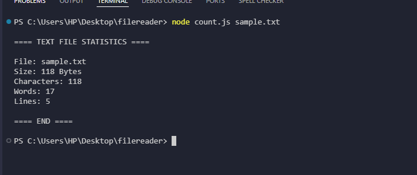
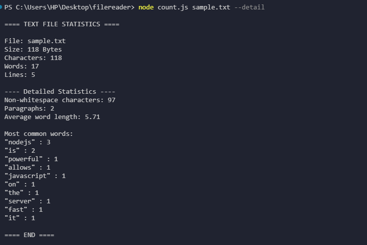

# Text File Analyzer (Node.js CLI)

A lightweight command-line tool built with Node.js that analyzes text files and generates useful statistics such as word count, line count, character count, and more detailed insights.

This project demonstrates working with the Node.js file system, command-line arguments, and data processing.

## Features

Analyze .txt files from the command line

Count characters, words, and lines

Display file size in readable format

Calculate paragraph count

Compute average word length

Show most frequently used words

Optional detailed analysis mode

## Project Structure
```bash
text-file-analyzer
│
├── count.js        # Main CLI application
├── sample.txt      # Example input file
└── README.md       # Project documentation
```
## Installation

Clone the repository:
```
git clone https://github.com/yourusername/text-file-analyzer.git
```
Navigate to the project directory:
```
cd text-file-analyzer
```
No external packages are required since the project uses built-in Node.js modules.

## Usage




### Basic command:
```
node count.js <file.txt>
```
### Example:
```
node count.js sample.txt
```
### Available Options

Option	Description
```
-h or --help	Show help message
-d or --detail	Show detailed statistics
```
Example with detailed statistics:
```
node count.js sample.txt --detail
```
Example Output
```
==== TEXT FILE STATISTICS ====

File: sample.txt
Size: 1.2 KB
Characters: 850
Words: 145
Lines: 24

---- Detailed Statistics ----

Non-whitespace characters: 720
Paragraphs: 4
Average word length: 4.92

Most common words:
"the": 8
"node": 5
"text": 4

==== END ====
```
## Technologies Used

Node.js

JavaScript

Node.js fs module

Node.js path module

## Learning Objectives

This project demonstrates:

Building a CLI application

Working with the file system in Node.js

Processing and analyzing text data

Handling command-line arguments

Writing clean and modular JavaScript code

## Future Improvements

Possible enhancements:

Support for additional file formats

Export statistics to JSON or CSV

Add interactive CLI options

Publish as an npm package
